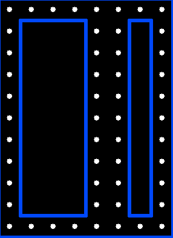
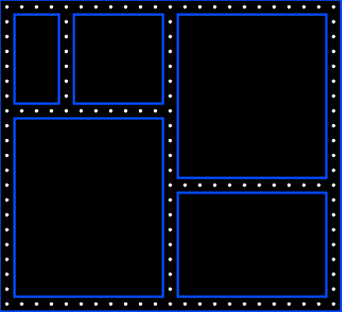

# Pacman

## <ins>Map generation</ins>
- The maps need to be at least 8x8 for the generation to be possible.

### **Algorithm**
- The basic map consists of **zeroes representing walls**, and **ones representing free** (walkable) tiles
- The algorithm **starts with map full of walls** (zeroes) and it continuously creates walkable paths (ones) inside it
- <ins>Step 1:</ins>
  - We always create paths on the edges of map
    - This is done so that there aren't any dead ends or unwanted map configurations
- <ins>Step 2</ins> 
  - We choose a random position on each of the four edges, and start filling that path with 1's
    - So for example, the top edge starts at the middle, and then goes all the way down, until it hits a wall
  - These are the four starting branches,
    - Each branch has a chance to create a subbranch for each tile it goes to
    - They can create a subbranch perpendicularly to the left or right (or both)
    - These subbranches can then create their own subbranches
    - The are two parameters:
      - MAX_BRANCHES 
        - Maximum number of times a branch can branch out. 
        - Branches inherit their parents branches_left minus 1.
      - BRANCH_CHANCE 
        - Chance to branch out at each tile
        - It has a BRANCH_CHANCE to branch left, and independent BRANCH_CHANCE to branch right
- Since we don't want to have two paths neigbouring each other, we keep tabs of the branches created, and forbid to creation of new ones on the same/neigbouring row/column 

|  | |
|:--:| :--|
| *unwanted neigbouring paths* | *Branch starts at the top in the middle. It than creates a subbranch on its right and than on its left. One subbranch also branches to its right* |

## <ins>Map logic</ins>
- The images, animations a logic of the map came from following repo: https://github.com/Gaspared/Pacman
- The map is a NxM array of short values, which follow the following rules:
  - 0 - zeroes represent walls
  - Any other number is a free path, that has...
    - +1 if it has a **left border** (with a wall)
    - +2 if it has a **top border**
    - +4 if it has a **right border**
    - +8 if it has a **bottom border**
    - +16 if it has a **contains food**
  - e.g. if a tile contains 28, it means that it contains food, and has a right and bottom border... Implying that on its left and top there are free paths 

 

- This means, that the map we generated has to be converted to this format
  - The algorithm for that is trivial

 

- Each tile is then visualised as a square with 36x36 pixels, on which ghosts and pacman move

## <ins>Pacman and Ghosts</ins>
- Both of these inherit a **GameObject** class
  - It has *x* and *y* coordinates, speed, and a ***direction*** (up, down, left, right, none)
  - It has simple methods for moving in a given direction, and checking for collisions with walls
  - The notable method is **atIntersection()**, which checks whether the object is at the middle of a tile
    - This is important, because that is the place where the object can change its direction or eat food

 

- Pacman has methods eating food and for receiving directions from the player

### Ghosts
- Ghosts get spawned randomly on the map, but with a minimal distance from packman
  - The distance is based on the map size
- Ghosts check for collisions with pacman, and if they collide, pacman dies
- In each game, there is exactly one ghost with the same speed as pacman
  - Other ghosts have randomized speeds, that are slower than pacman
- The speeds need to be a factor of the size of blocks (36), becuase **atIntersection()** checks for the middle of a tile
- The number of ghosts is based on the map 
  - It is approximately the cube root of the number of tiles
- Ghosts always follow pacman
  - They look up their directions in a HashMap, that takes positions of two tiles, and returns the direction to go from the first tile to the second
  - The HashMap is precalculated so that ghosts don't have to calculate directions every time, and the game can run smoothly

## <ins>Path seeking algorithm</ins>
- It uses the A* algorithm, which is a variant of Dijkstra's algorithm that uses heuristics to find the shortest path
- A great decription of the algorithm can be found here: https://youtu.be/-L-WgKMFuhE
- As said above, the directions for each pair of tiles are precalculated and stored in a HashMap

